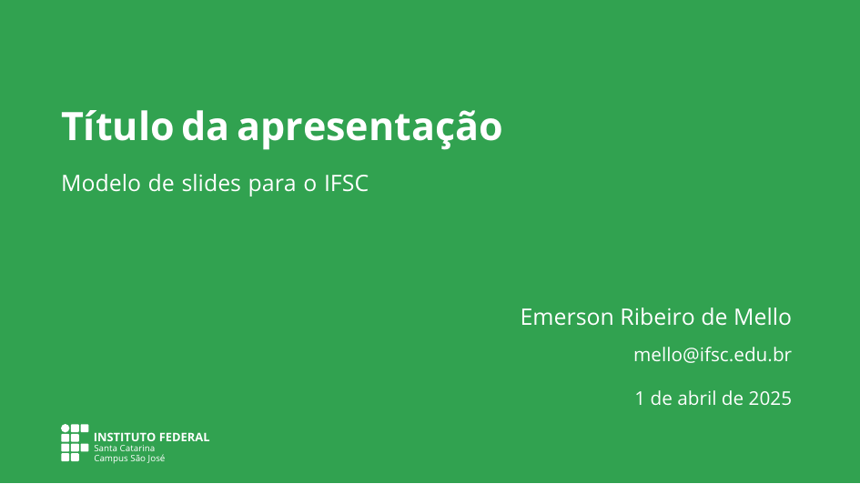
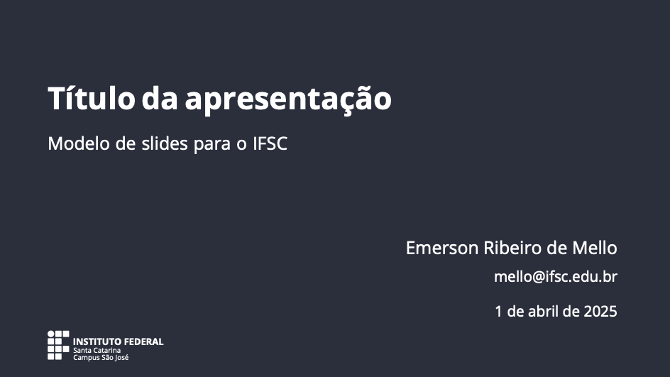
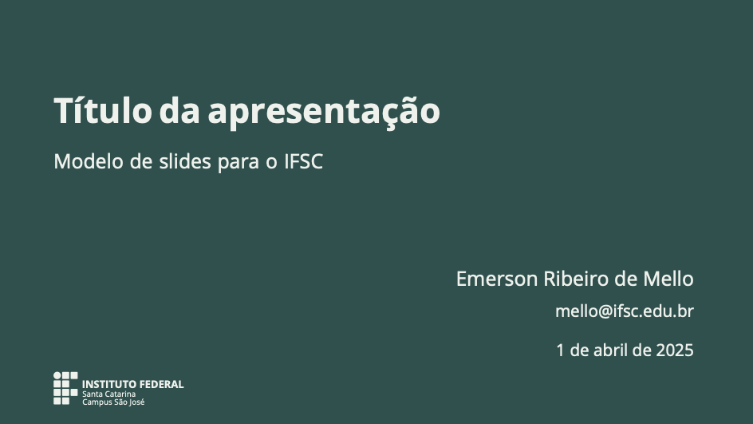
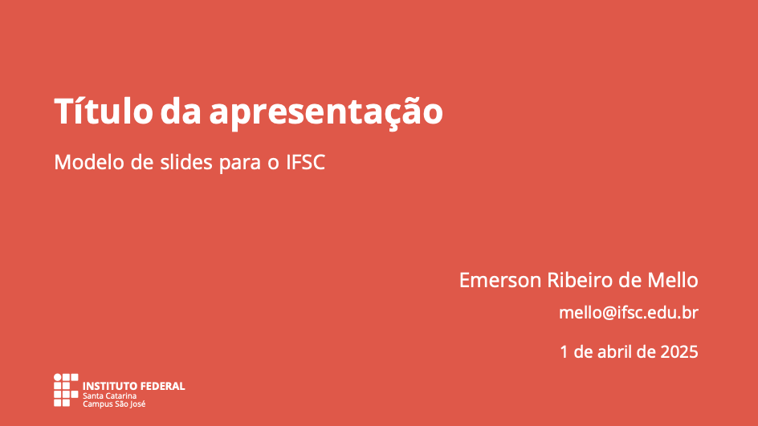
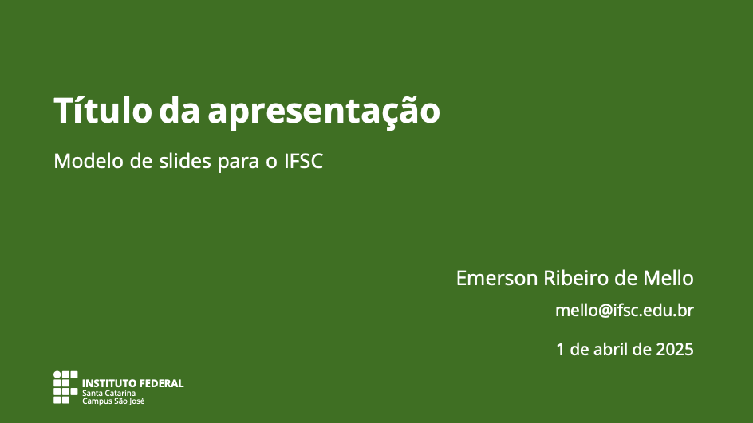
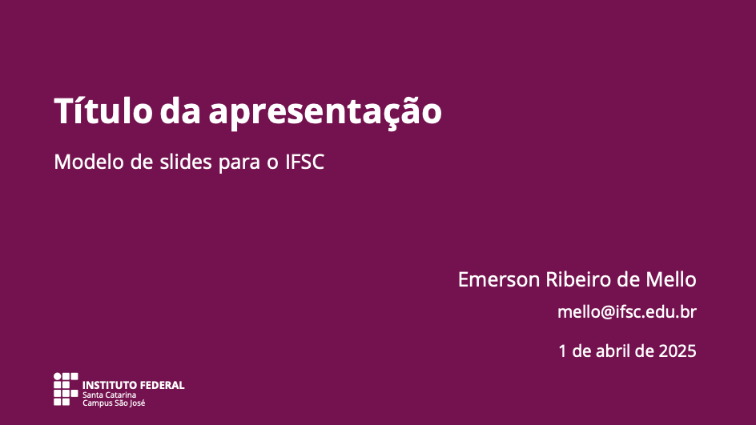
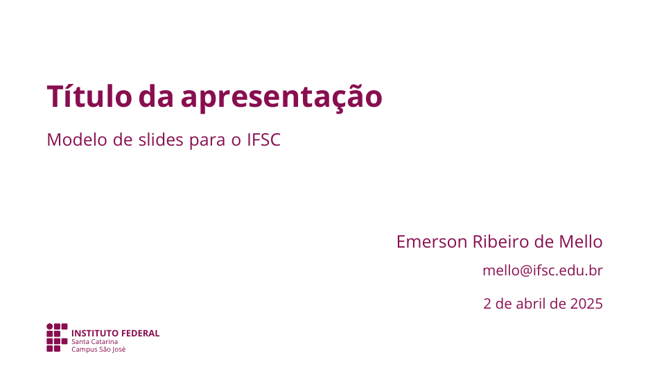

# Modelo de apresentação - IFSClean

Esse tema permite a personalização das cores do texto e do fundo. Basta informar as cores como argumentos do pacote.

## Captura de telas (proporção 16x9)

## Outras cores

