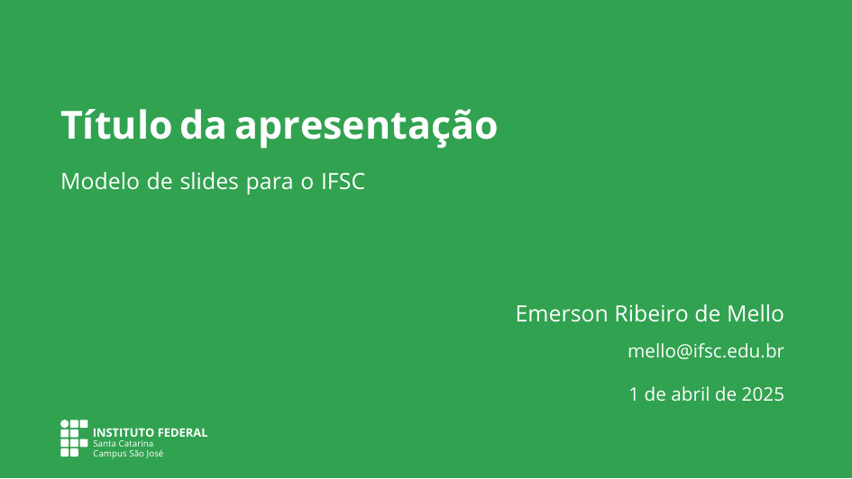

# Modelo de apresentação - IFSClean

Esse tema permite a personalização das cores do texto e do fundo. Basta informar as cores como argumentos do pacote.

```latex
\usetheme[
    foreground=azulclaro, % cor do texto (usado no título dos slides) 
    % background=white, % cor do fundo dos slides
    % textfg=black, % cor do texto nos slides
    % titlefg=redwine, % cor do texto do slide de título
    titlebg=azulclaro, % cor do fundo do slide de título
    frametitlefg=azulclaro, % cor do texto do título do frame
    % frametitlebg=redwine, % cor do fundo do título do frame
    % sectionfg=redwine, % cor do texto do slide da seção
    sectionbg=azulclaro, % cor do fundo do slide de seção
    % blocktitlefg=white, % cor do texto do título dos blocos
    blocktitlebg=azulclaro, % cor do fundo do título dos blocos
    % blockbodyfg=cinzaescuro, % cor do texto dentro dos blocos
    % itemsep=7pt % Espaçamento entre os itens das listas
    titlebackground=img/sao-jose.jpg, % Imagem de fundo do slide de título
    titlebackgroundopacity=1, % Opacidade da imagem de fundo do slide de título (valor entre 0 e 1)
    % logo=img/ifsc-logo-h-branco.png % Logo do IFSC no slide de título
]{ifsclean}
```

## Fontes necessárias para compilar os arquivos .tex

### Com LuaLaTeX

Para usar o compilar LuaLaTeX é necessário ter as seguintes fontes instaladas no sistema:

- [Inter](https://rsms.me/inter/)
    - Fonte sans-serif usada como padrão no textos e títulos dos slides.
- [Inconsolata](https://fonts.google.com/specimen/Inconsolata)
    - Fonte monoespaçada usada para código-fonte e outros elementos que requerem espaçamento fixo.
- [Literata](https://fonts.google.com/specimen/Literata)
    - Fonte serifada

Execute o comando `luaotfload-tool --update` no terminal para atualizar a base de fontes do LuaLaTeX e assim ele poderá encontrar as fontes Inter e Inconsolata para compilar os arquivos .tex corretamente. Esse comando costuma demorar um pouco devido ao número de fontes instaladas no sistema. 


## Captura de telas





