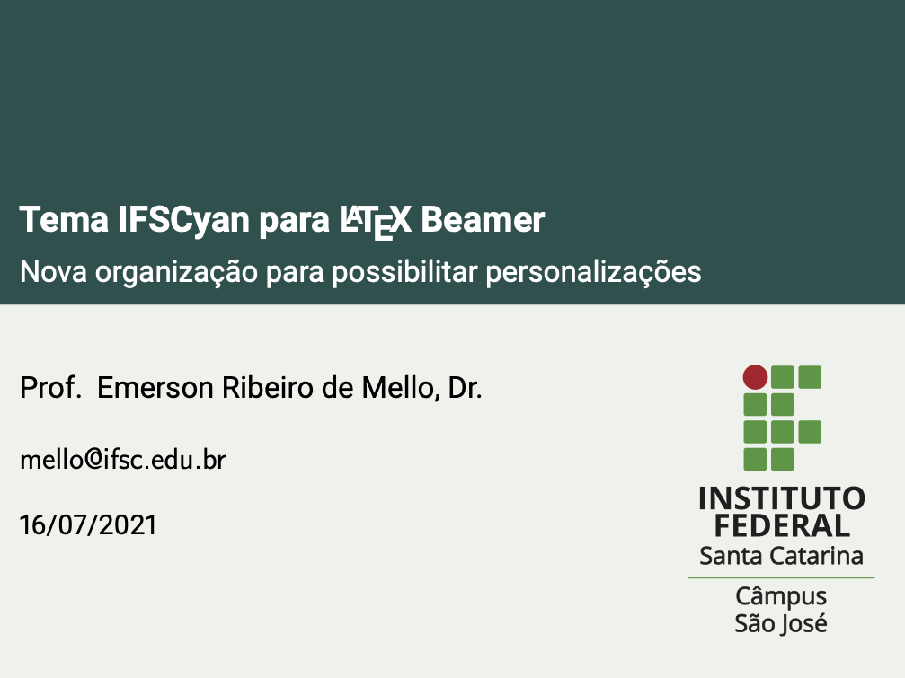
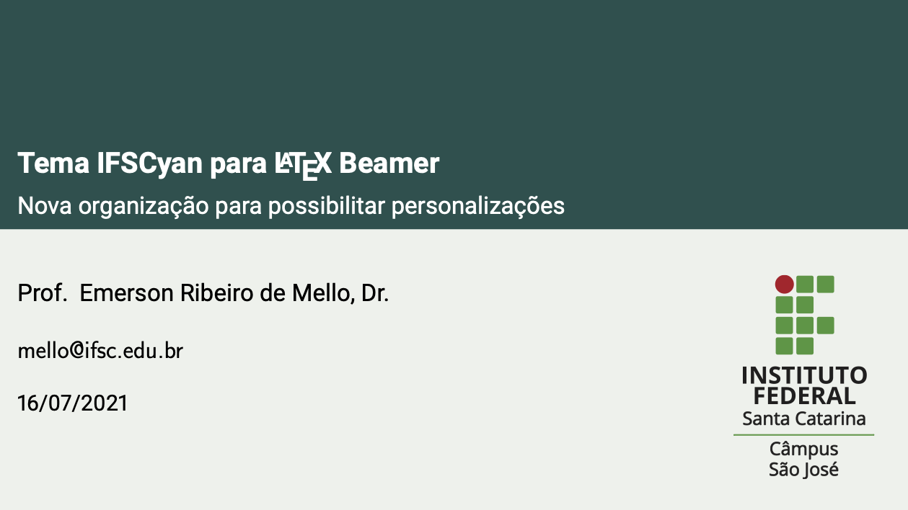
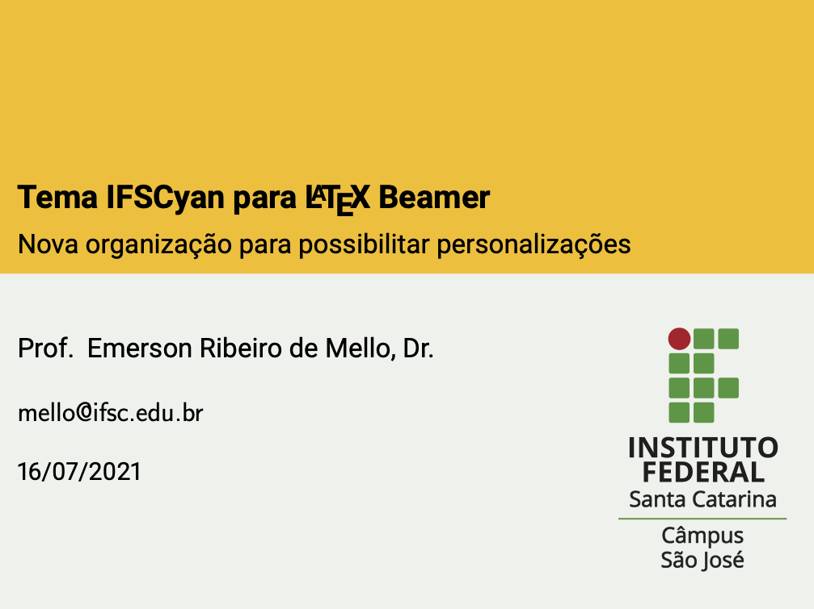
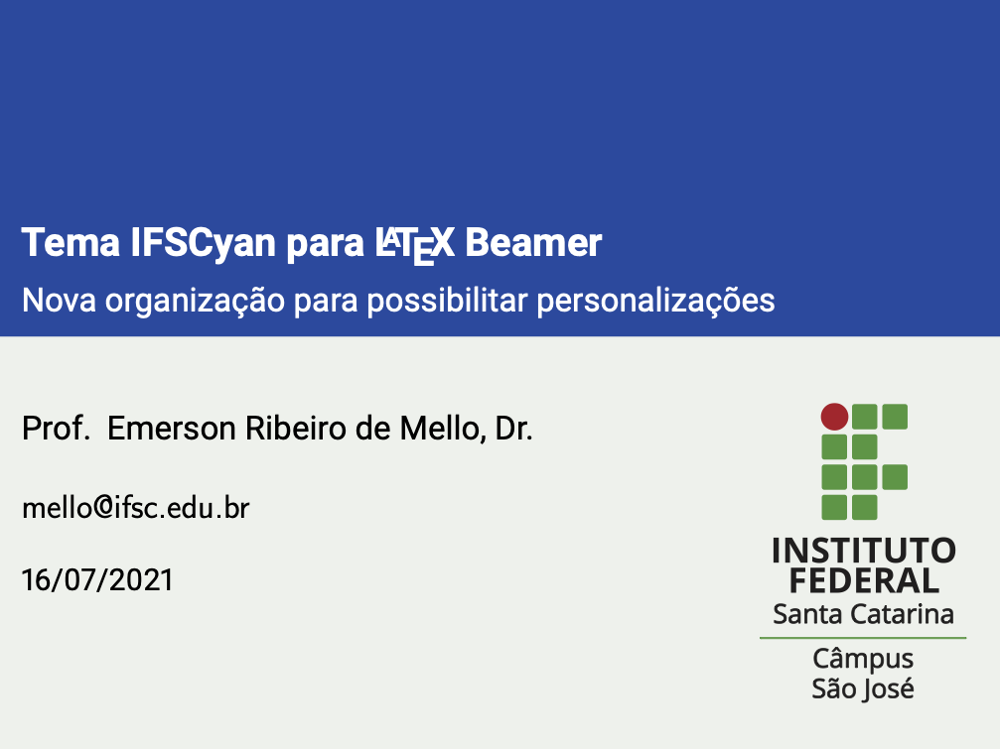
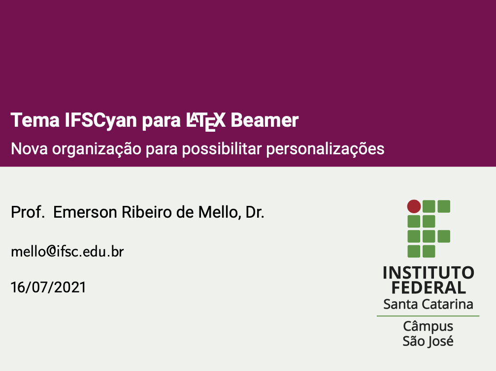
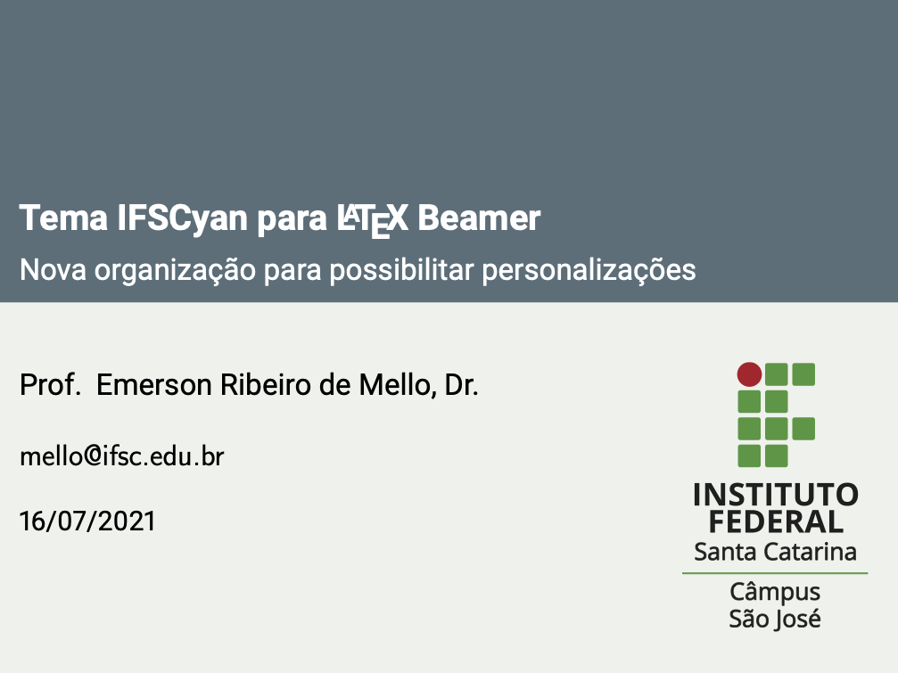
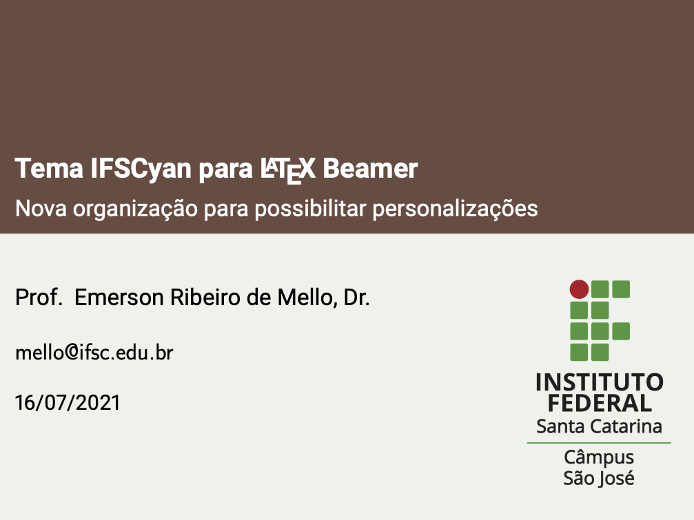
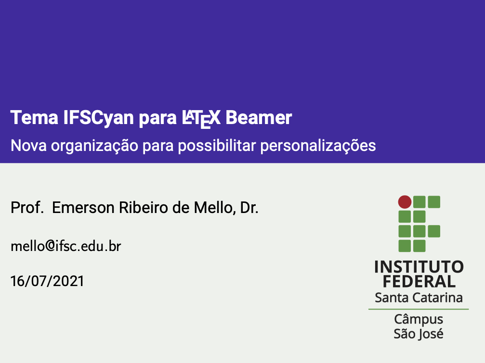

# Modelo de apresentação - IFSCyan

Esse tema permite a personalização das cores do texto e do fundo. Basta informar as cores como argumentos do pacote.

## Captura de telas (proporção 4x3)

## Proporção 16x9 (widescreen)

## Outras cores

