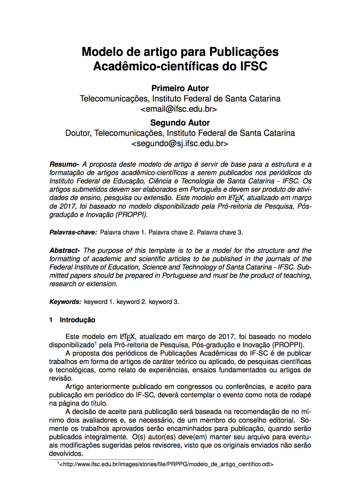
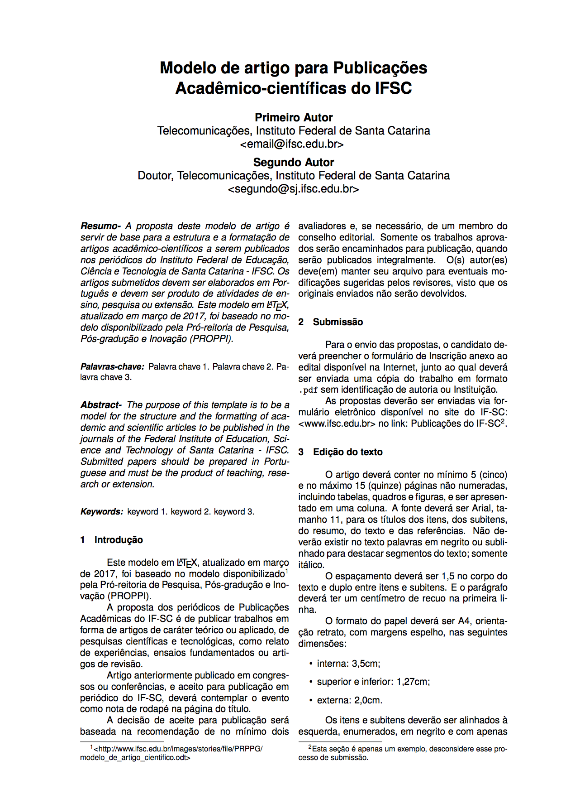

# Modelo de artigo para Publicações Acadêmico-científicas do IFSC

Esse modelo está baseado no [modelo fornecido pela Pró-Reitoria de Pesquisa, Pós-graduação e Inocação (PROPPI)](http://www.ifsc.edu.br/images/stories/file/PRPPG/modelo_de_artigo_cientifico.odt) do IFSC. O estilo bibliográfico seguem as normas da ABNT, providas pelo pacote [abnTeX2](https://github.com/abntex/abntex2).

## Captura de tela - 1 coluna

## Captura de tela - 2 colunas

