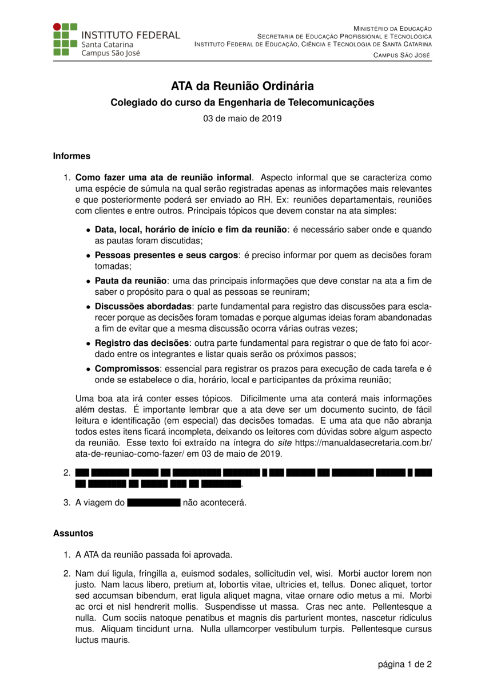

# Modelo de ATA de reuniões

Este é um modelo de ATA de reuniões, que pode ser utilizado para registrar as discussões e decisões tomadas durante uma reunião. O modelo inclui campos para o nome da reunião, data, hora, local, participantes, pauta, discussões e decisões.

> [!NOTE]
> As classes (.cls) e estilos (.sty) utilizados neste modelo encontram-se no diretório [classes](../classes). 
>
> No arquivo [.latexmkrc](latexmkrc) é definida a variável de ambiente `TEXINPUTS` para incluir o diretório [classes](../classes), facilitando a compilação do documento usando o comando `latexmk`. 
>
> Se você estiver utilizando um editor de LaTeX, certifique-se de configurar o caminho para as classes corretamente, ou utilize o comando `latexmk` para compilar o documento sem se preocupar com os caminhos.

## Captura de telas

