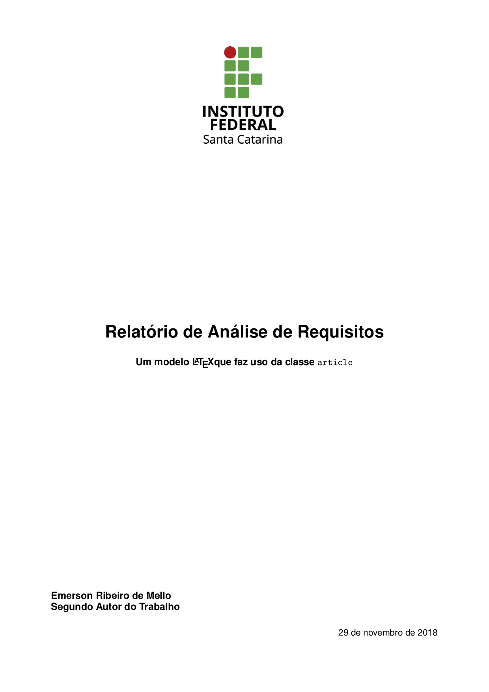
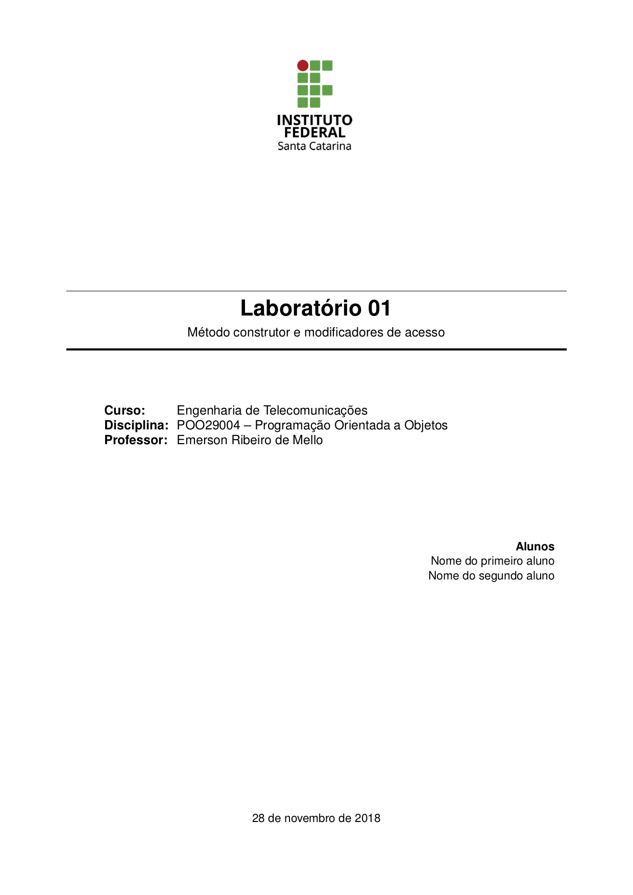

# Modelo de Relatório

Esse modelo faz uso da classe `article` e apresenta um exemplo de um relatório simples. São apresentados dois modelos de capa.

> [!NOTE]
> As classes (.cls) e estilos (.sty) utilizados neste modelo encontram-se no diretório [classes](../classes). 
>
> No arquivo [.latexmkrc](latexmkrc) é definida a variável de ambiente `TEXINPUTS` para incluir o diretório [classes](../classes), facilitando a compilação do documento usando o comando `latexmk`. 
>
> Se você estiver utilizando um editor de LaTeX, certifique-se de configurar o caminho para as classes corretamente, ou utilize o comando `latexmk` para compilar o documento sem se preocupar com os caminhos.

## Capa modelo 1

## Capa modelo 2
