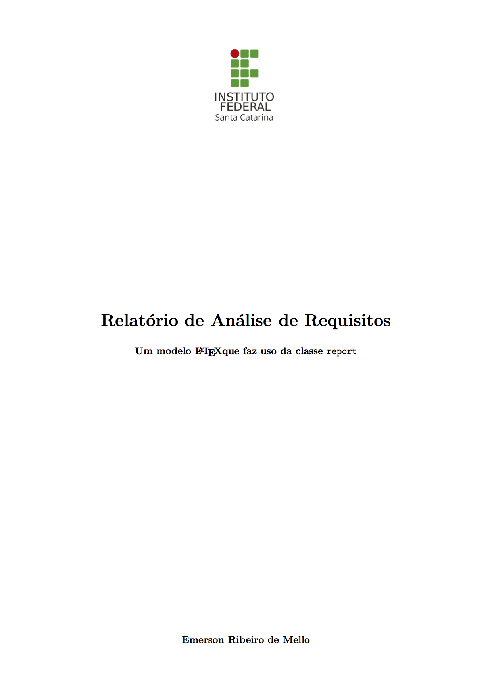
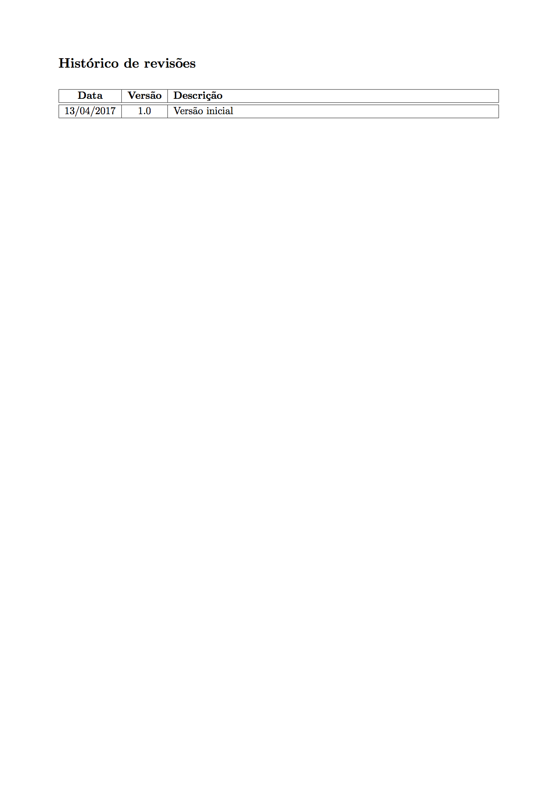
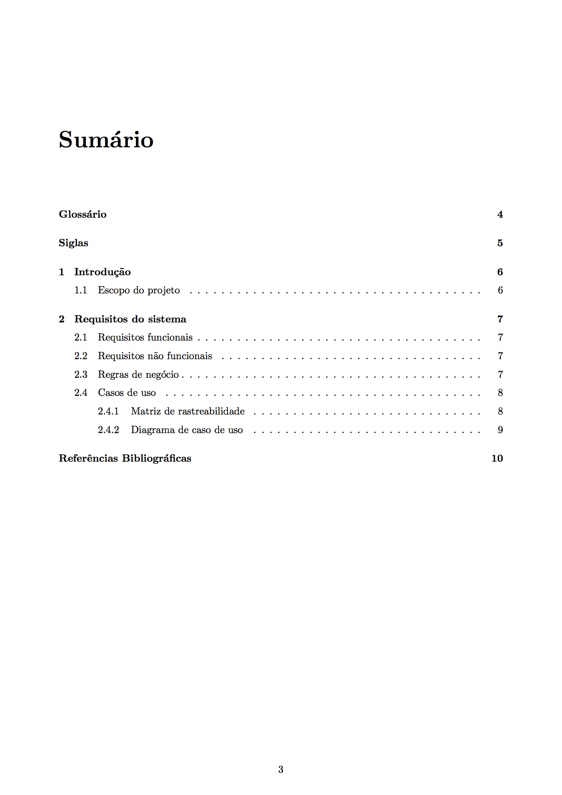
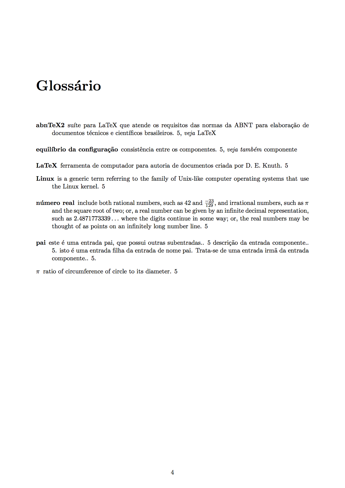
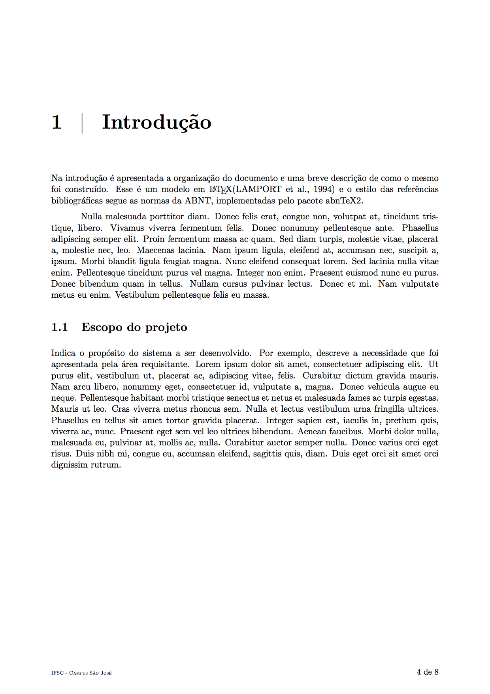

# Modelo de Relatório

Esse modelo faz uso da classe `report` e apresenta um exemplo de como gerar glossário e lista de siglas com o pacote `glossary`. Para as referências bibliográficas foi feito uso do estilo fornecido pelo pacote [abnTeX2](https://github.com/abntex/abntex2).

## Capturas de tela

